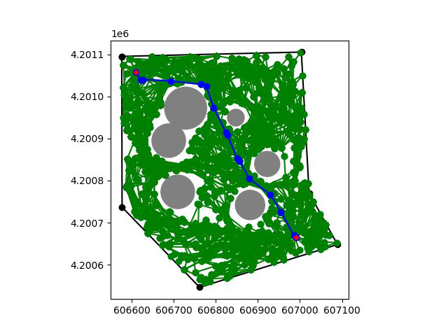
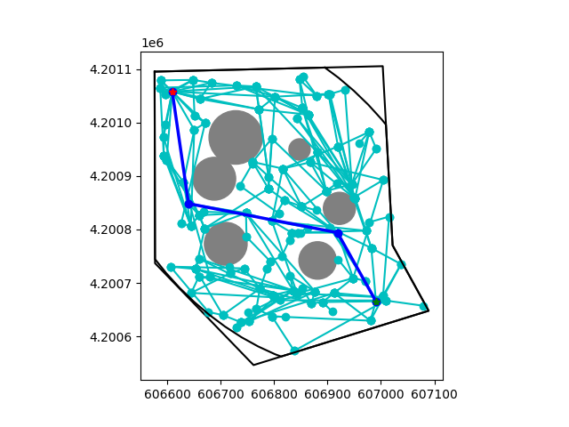
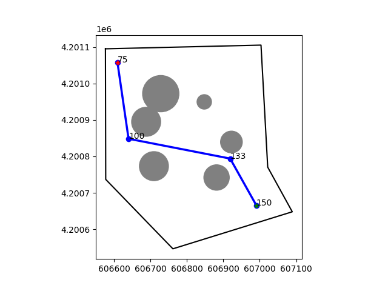
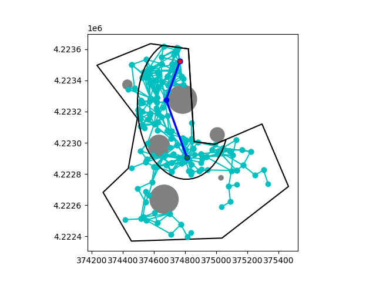
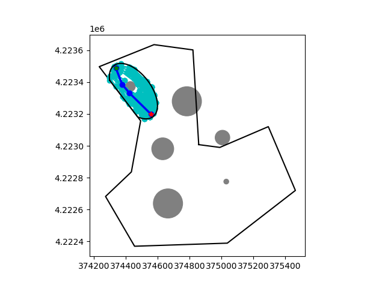
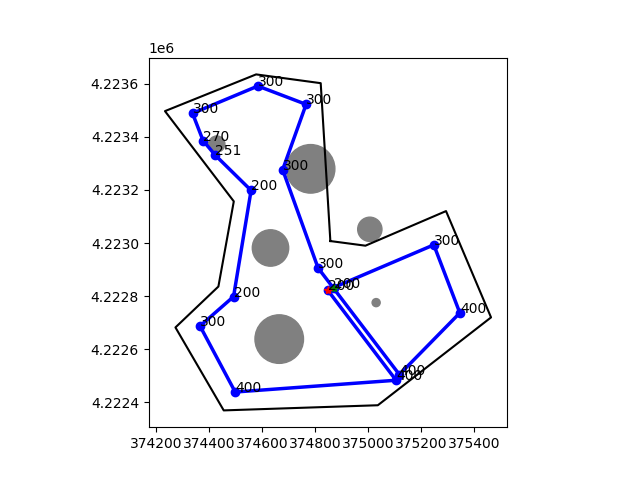
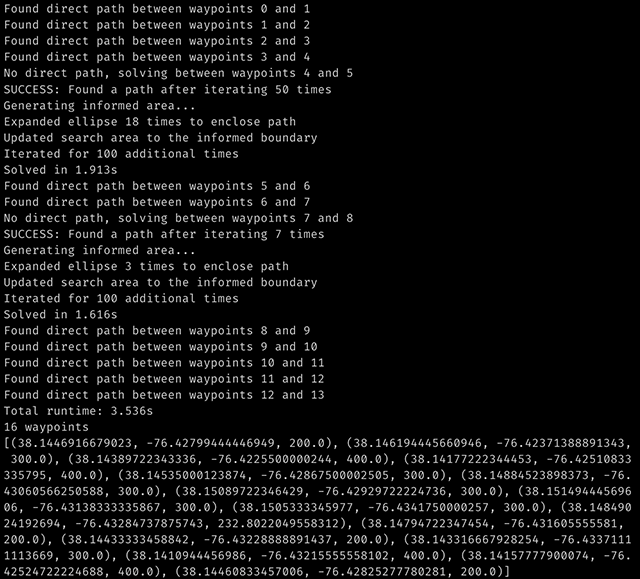

# Obstacle Avoidance with the Informed RRT* Algorithm

An advanced obstacle avoidance algorithm that implements the Informed RRT* algorithm (Rapidly-exploring Random Trees) to generate a collision-free path between waypoints in a bounded space.

Originally written for the Multirotor Robot Design Team at Missouri S&T for the SUAS 2022 competition.

Inspired by and adapted from https://gist.github.com/Fnjn/58e5eaa27a3dc004c3526ea82a92de80

## Reading

* Algorithm paper: https://ieeexplore.ieee.org/document/6942976
* Video explanation: https://youtu.be/QR3U1dgc5RE
* UTM projection for GPS coordinates: https://en.wikipedia.org/wiki/Universal_Transverse_Mercator_coordinate_system

## Features

* This implementation focuses on aerial navigation and utilizes existing altitude data to determine the altitude of newly added waypoints, resulting in a linear progression in altitude between the original points. Altitude data is provided on the standard plot.
* Each pair of waypoints is tested for collisions and will only be processed by the algorithm if a collision is detected.
* A relax path algorithm is used to remove unnecessary waypoints from the solved path to have as few changes in heading as possible.
* A list of boundary coordinates is used to restrict path solutions to within the boundary. This is useful for competition requirements.
* A UTM projection is used for convenience so that all calculations can use the cartesian coordinate system in meters. Zone information is stored from the first boundary point and used for all other given coordinates. Inaccuracies from this should only arise if the user's boundary is larger than the size of a UTM zone.

## Usage

```
pip3 install -r requirements.txt
python3 path_finder.py
```

May also need to install geos if getting a relevant error: https://libgeos.org/usage/install/

### path_finder.solve()

This is the primary method and is outlined below. This takes several lists of gps coordinates for the boundary space, obstacles, and waypoints and returns the final path. Setting show_plot or debug_plot to True will enable the standard or debugging plots respectively. The debug plot will show the randomly-generated tree, informed area, and final path for each pair of waypoints the algorithm processes. 

```
path_finder.solve(
    d_boundary: List[Dict[str, float]],
    d_obstacles: List[Dict[str, float]],
    d_waypoints: List[Dict[str, float]],
    show_plot: bool = False,
    debug_plot: bool = False,
) -> List[Tuple[float, float, float]]:
```

Full example data and usage is provided in the main function in `path_finder.py`.

### Global Parameters

These parameters can be tuned based on the scale of the search space and density of obstacles for your purposes.

* `OBSTACLE_BUFFER` - Adds a buffer to obstacles to account for gps inaccuracies (meters)
* `STEP_SIZE` - Max distance between vertices in graph (meters). See algorithm details for more information.
* `NEIGHBORHOOD_SIZE` - Search radius around current node for optimizing path (meters). See algorithm details for more information.
* `MAX_ITERATIONS` - Max number of iterations before failing to find a path. This can be set very high and not impact performance if the average solution time remains low because the algorithm will stop iterating once it finds a single path, and then moves to the informed search step.
* `INFORMED_ITERATIONS` - Max number of iterations performed in the informed area. Once the algorithm has found a path it will always perform this many more iterations in the informed area (the ellipse) in order to optimize the path.

## Results

### Preliminary testing: RRT, no optimizations

Runtime: 84s



### Informed RRT* with optimized parameters

Runtime: 1.644s




### Additional example with detailed console output





